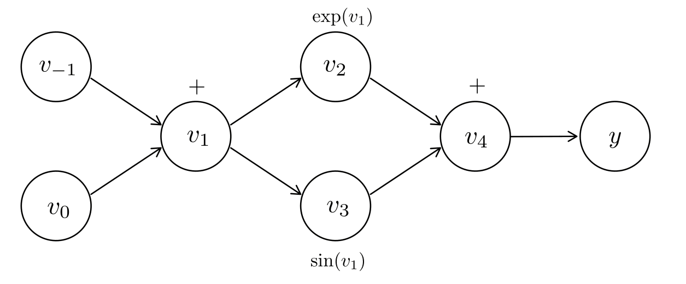
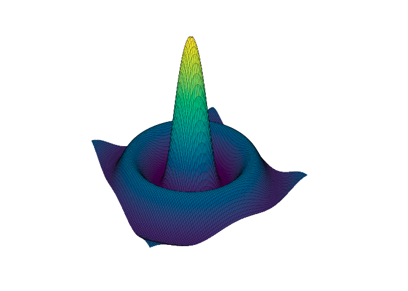
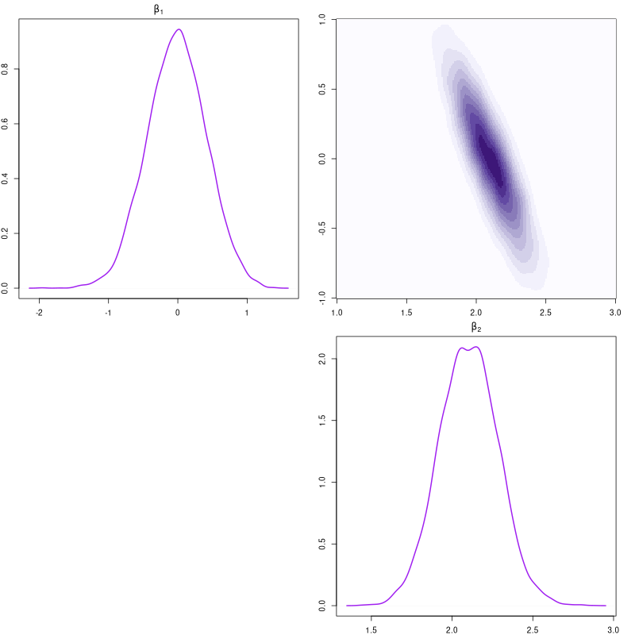

## Abstract

We demonstrate the use of a C++ algorithmic differentiation library and show
how it can be used with the R programming language to solve problems in optimization, 
MCMC and beyond. We hope such integrations will enable package
developers to produce robust efficient code by overcoming the need to produce
functions that compute gradients.

### Keywords

R package development, algorithmic-differentiation, Rcpp

## Introduction

Algorithm differentiation (AD), also known as automatic-differentiation, has
found wide use in machine leaning and statistics. As the name suggest AD allows
for the automatic computation of derivatives, removing the need to painstakingly
derive there expressions. We present a brief overview of AD and demonstrate how
it can be used in package development.


## Methods

AD allows for fast computation of function gradients through repeated
application of the chain rule. For a detailed introduction to AD we 
direct the reader to @Gebremedhin2020. There are two modes of AD: *forward mode* and
*reverse mode*. Throughout our explanation of these modes we will consider the
function, 
$$ f(x_1, x_2) = \exp(x_1 + x_2) + \sin(x_1 + x_2), $$ 
where $x_1,x_2 \in \mathbb{R}$. The computation graph for $f$ is presented 
in Figure 1. 




### Forward mode

Forward mode AD involves propagation of derivatives with the evaluation of the
function. For instance, we can break our example function, $f$, into a sequence
of elemental operations, presented in the first column of Table 1. As these
elemental operations have known derivatives we can compute expression for them,
presented in the third column of Table 1. For instance, consider $\partial
f/\partial x_1$ evaluated as $x_1=0.5$ and $x_2=1$, we can compute both the
gradient and function evaluations, as presented in columns two and four resp.

| Function                |            | Gradient                                 | Derivative wrt. $x_1$ |
|:---|:---|:---|:---|
| $v_{-1} = x_1$          | $= 0.5$    | $\dot{v}_{-1} = \dot{x}_1$               | $= 1$     |             
| $v_{0} = x_2$           | $= 1$      | $\dot{v}_{0} = \dot{x}_2$                | $= 0$     |
| $v_{1} = v_{-1} + v_0$  | $= 1.5$    | $\dot{v}_{1} = \dot{v}_{-1} + \dot{v}_0$ | $= 1$   |
| $v_{2} = \exp(v_1)$     | $= 4.4817$ | $\dot{v}_{2} = \exp(v_1)*\dot{v}_1$      | $=4.4817$ |
| $v_{3} = \sin(v_1)$     | $= 0.9975$ | $\dot{v}_{3} = \cos(v_1)*\dot{v}_1$            | $=0.0707$ |
| $v_{4} = v_2 + v_3$     | $= 5.4792$ | $\dot{v}_{4} = \dot{v}_2 + \dot{v}_3$    | $=4.5524$ |
| $y = v_4$               | $= 5.4791$ | $\dot{y} = \dot{v}_4$                    | $=4.5524$ |

**Table 1.** Forward mode AD for $f$.

Notably, for a function $g : \mathbb{R}^n \to \mathbb{R}^m$, forward mode AD
requires $n$ passess to compute the derivative wrt. to each input.


### Reverse mode

Reverse mode AD involves computing derivatives by starting from the
function value $y$ and traversing the computation graph in reverse towards
the independent variables $x$ [@Gebremedhin2020]. Unlike forward mode, derivatives
are not pragated alongside the evaluation of the functions. Instead, we first
evaluate the function and then compute the derivatives. Continuing with our example,
we denomstrate the steps involved in reverse mode AD for $f(x_1, x_2)$, as before we have taken
 $x_1=0.5$ and $x_2=1$.

Noting that unlike forward mode AD, we evaluate the gradient for both
$x_1$ and $x_2$ in one pass. Hence, for functions $f: \mathbb{R}^n \rightarrow \mathbb{R}^m$
it is more efficient to use reverse mode AD when $n>m$.


| Gradients (or Adjoints)                  | Value |
|:---|:---|
| $\bar{v}_{4} = \bar{y}$		   | $=1$      |
| $\bar{v}_{3} += \bar{v}_5$		   | $=1$      |
| $\bar{v}_{2} += \bar{v}_5$		   | $=1$      |
| $\bar{v}_{1} += \cos(v_1)*\bar{v}_3$	   | $=0.0707$ |
| $\bar{v}_{1} += \exp(v_1)*\bar{v}_2$	   | $=4.5524$ |
| $\bar{v}_{0} += \bar{v}_1$		   | $=4.5524$ |
| $\bar{v}_{-1} += \bar{v}_1$		   | $=4.5524$ |
| $x_{1} = \bar{v}_0$			   | $=4.5524$ |
| $x_{2} = \bar{v}_{-1}$		   | $=4.5524$ |
 
**Table 2.** Reverse mode AD for $f$.

## Examples

To illustrate the use of AD for R package deleopment we have provided an
accompanying repository, available at https://github.com/mkomod/user21_ex. To
perform AD we rely on the CppAD library [@cppad]. Noting we have included the source
for the library under the `./inst/include` directory of our package. Further we
use `Rcpp` to expose C++ functions to the R environment.


### Optimization

We are going to be considering the function
$$
    f(x_1, x_2) = \frac{\sin(\sqrt(x_1^2 + x_2^2))}{\sqrt(x_1^2 + x_2^2))}
$$
Presented in Figure 2. Our aim is to use AD to find the maxima of $f$.

**Figure 2.** $f(x_1, x_2)$

To begin with we define an objective function of interest in C++, noting we are using Rcpp to expose these functions to the R environment.

```{c++}
using namespace CppAD;
using namespace Eigen;

// [[Rcpp::export]]
double fx(VectorXd x) {
    double r = 0.0;
    for (int i = 0; i < x.rows(); ++i)
        r += x(i) * x(i);
    r = sqrt(r);
    return sin(r)/r;
}
```

We then set up the auto-diff version, noting that we have to use `CppAD::AD<double>` objects rather than regular double, similarly for matrices / vectors we use the `AD<double>` object in place of `double` when declaring matrices / vectors from the `Eigen` library.

```{c++}
typedef AD<double> a_double;
typedef Matrix<a_double, Eigen::Dynamic, 1> a_vector;

a_double fx(a_vector x) {
    a_double r = 0.0;
    for (int i = 0; i < x.rows(); ++i)
        r += x(i) * x(i);
    r = sqrt(r);
    return sin(r)/r;
}
```

Within `fx` we explicitly write our loops summing variables. 

To expose the gradient we create the `fp` function, which relies on reverse mode AD through CppAD to compute gradients

```{c++}
// [[Rcpp::export]]
VectorXd fp(VectorXd x) 
{
    a_vector ax(x.rows());
    a_vector y(1);
    ADFun<double> gr;

    for (int i = 0; i < x.rows(); ++i)
        ax(i) = x(i);

    Independent(ax);            // declare the elements of x as independent inputs
    y(0) = fx(ax);              // begin trace (for reverse mode AD), this creates the
                                // computation graph
    gr.Dependent(ax, y);        // stop recording

    return gr.Jacobian(x);      // return the Jacobian
}
```

Using Rcpp we compile and expose the `fx` and `fp`, making them directly available in R. We can use the built-in `optim` function to find maxima,


```r
x <- matrix(c(1, 0.2))
optim(x, fx, fp, method="CG", control=list(fnscale=-1))
```
Returning a maxima at $(5\times 10^{-6}, 1 \times 10^{-6})$ with a function
value of $1$.

### Hamiltonian Monte-Carlo

Hamiltonian Monte Carlo (HMC) is a method used to sample from conditional
distributions. HMC is most widely used in Bayesian inference, and offers an
efficient way to sample from posterior distributions. For a review of HMC we
direct the reader to @Neal2011. For our example we consider the model
$$
y_i = \beta^\top x_i + \epsilon_i, \quad \epsilon_i \overset{iid}{\sim} N(0, \sigma^2), \quad i = 1, \dots, n,
$$
where $\beta, x_i \in \mathbb{R}^p$ are vectors of coefficients and explanatory
variables respectively. 

Denoting our observed data as $\mathcal{D} = (y_i, x_i)_{i=1}^n$ and letting $\beta^\top = (0, 2)$ and $\sigma=1$, we generate $n=20$ observations. For our prior on $\beta$, we let
$$
    \beta_j \sim N(0, \sigma^2_\beta), \quad j = 1, 2,
$$
with $\sigma_\beta=5$

To perform HMC we compute
$$
U(\beta; \mathcal{D}) = \log \left( L(\mathcal{D}; \beta) \pi(\beta) \right)
$$
where $L(\beta; \mathcal{D})$ is our likelihood function and $\pi(\beta)$ the density function of
our prior. We presented the implementation of $U(\beta; \mathcal{D})$ below

```{c++}
a_double U(a_vector beta, VectorXd y, MatrixXd x, double s, 
    VectorXd mu_beta, VectorXd s_beta) 
{
    a_double l = 0.0;
    for (int i = 0; i < y.rows(); ++i) {
        a_double m = 0.0;
        for (int j = 0; j < beta.rows(); ++j) {
            m += beta(j) * x(i, j);
        }
        l += log(1/(sqrt(2.0*PI)*s)) - pow((y(i)-m)/s, 2)*0.5;
    }
    l += log_p(beta, mu_beta, s_beta);
    return l;
}
```

As before, we have been explicit in computing sums to ensure the computation graph can be constructed.

For the sake of brevity we do not present the code exporting the gradient of
$U$, noting it is essentially identical as in the previous example. To
implement HMC we use boilerplate code by [@Neal2011], also available
[online](http://www.cs.utoronto.ca/~radford/ham-mcmc-simple).

Running our Markov chain for $10,000$ iterations we obtain posterior samples for $\beta_1$ and $\beta_2$. We present the joint and marginal density is Figure 3.



Noting that the modes of the marginal densities are approximately at $0.0$ and $2.0$ as expected.

The intention of this second example is to demonstrate that we can perform MCMC
by specifying an objective function. We can then use off-the-shelf code to run
our HMC sampler and avoid having to derive gradients by using AD. A further
attractive feature of AD is that we only need to test one function; if our
objective is correct, then our gradient function will also be correct.

## Conclusions

In recent years there has been a push to bring AD to R natively, for example,
projects such as Pqr have extended R's core functionality to include AD [@pqr].
We have presented an alternative option for computing gradients in R through
Rcpp and CppAD. Evidently, the requirement of external libraries does not allow
for wide scale use, however, we hope such options will encourage package
developers to bring AD into their projects.

## Declarations

### List of abbreviations

 - AD: algorithmic differentiation
 - HMC: Hamiltonian Monte Carlo

### Availability of supporting source code and requirements

-   Project home page: https://github.com/mkomod/user21_ex
-   Programming language: R, C++
-   License: GNU GPL

# References

